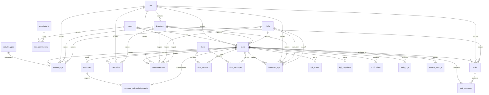

# OCC Database ERD
## Entity Relationship Diagram
### Operational Control Center – Dealing
### Solid Group

---

# 1. TUJUAN DOKUMEN

Dokumen ini menjelaskan struktur database OCC (Operational Control Center) dalam bentuk **ERD konseptual** agar:

- relasi antar tabel jelas
- developer mudah membangun backend
- database scalable untuk pengembangan berikutnya
- struktur data tetap rapi saat OCC berkembang

Dokumen ini adalah pelengkap dari:

1. **OCC Final Master Blueprint**
2. **OCC Ultimate Build Prompt**
3. **OCC Dashboard Command Center Layout**

---

# 2. RUANG LINGKUP DATABASE

Database OCC dirancang untuk mendukung:

- manajemen user dan role
- master PT, cabang, dan shift
- activity log
- task management
- complaint management
- pengumuman dan pesan resmi
- chat internal
- handover shift
- KPI dan leaderboard
- notifikasi
- audit trail
- system settings

---

# 3. DAFTAR TABEL UTAMA

## Master & Access
- roles
- permissions
- role_permissions
- users

## Organisasi
- pts
- branches
- shifts

## Aktivitas & KPI
- activity_types
- activity_logs
- kpi_scores
- kpi_snapshots

## Operasional
- tasks
- task_comments
- complaints
- handover_logs

## Komunikasi
- announcements
- messages
- message_acknowledgements
- chats
- chat_members
- chat_messages

## Sistem
- notifications
- audit_logs
- system_settings

---

# 4. ENTITY RELATIONSHIP DIAGRAM (MERMAID)

---

# 5. PENJELASAN RELASI INTI

## 5.1 User & Role
Setiap user memiliki satu role utama.

Contoh:
- satu user = satu role
- satu role bisa dimiliki banyak user

Relasi:
- `roles.id` → `users.role_id`

---

## 5.2 PT, Cabang, dan Shift
Setiap user berada dalam konteks organisasi:

- 1 user terhubung ke 1 PT
- 1 user dapat terhubung ke 1 cabang
- 1 user terhubung ke 1 shift

Relasi:
- `pts.id` → `users.pt_id`
- `branches.id` → `users.branch_id`
- `shifts.id` → `users.shift_id`

---

## 5.3 Activity Log
Setiap activity log:

- dibuat oleh 1 user
- memiliki 1 jenis aktivitas
- terkait dengan 1 PT
- opsional terkait cabang
- terkait shift

Relasi:
- `users.id` → `activity_logs.user_id`
- `activity_types.id` → `activity_logs.activity_type_id`
- `pts.id` → `activity_logs.pt_id`
- `branches.id` → `activity_logs.branch_id`
- `shifts.id` → `activity_logs.shift_id`

---

## 5.4 Task Management
Task:

- dibuat oleh 1 user
- ditugaskan ke 1 user
- berada dalam konteks PT / cabang
- dapat memiliki banyak komentar

Relasi:
- `users.id` → `tasks.assigned_to`
- `tasks.id` → `task_comments.task_id`
- `users.id` → `task_comments.user_id`

---

## 5.5 Complaint Management
Complaint:

- dibuat oleh user tertentu
- ditangani user tertentu
- terkait PT / cabang
- memengaruhi dashboard dan KPI

Relasi:
- `users.id` → `complaints.assigned_user_id`
- `pts.id` → `complaints.pt_id`
- `branches.id` → `complaints.branch_id`

---

## 5.6 Announcements
Pengumuman dapat ditargetkan berdasarkan:

- PT
- cabang
- shift
- role

Relasi:
- `users.id` → `announcements.created_by`
- `pts.id` → `announcements.pt_id`
- `branches.id` → `announcements.branch_id`
- `shifts.id` → `announcements.shift_id`
- `roles.id` → `announcements.role_id`

---

## 5.7 Official Messages
Pesan resmi:

- dikirim oleh user
- dapat membutuhkan acknowledgment
- acknowledgment dicatat per user

Relasi:
- `users.id` → `messages.sender_id`
- `messages.id` → `message_acknowledgements.message_id`
- `users.id` → `message_acknowledgements.user_id`

---

## 5.8 Chat
Chat terdiri dari:

- satu entitas chat room
- banyak anggota
- banyak pesan

Relasi:
- `chats.id` → `chat_members.chat_id`
- `users.id` → `chat_members.user_id`
- `chats.id` → `chat_messages.chat_id`
- `users.id` → `chat_messages.sender_id`

---

## 5.9 Shift Handover
Handover mencatat perpindahan dari satu shift ke shift lain.

Relasi:
- `users.id` → `handover_logs.created_by`
- `pts.id` → `handover_logs.pt_id`
- `branches.id` → `handover_logs.branch_id`
- `shifts.id` → `handover_logs.from_shift_id`
- `shifts.id` → `handover_logs.to_shift_id`

---

## 5.10 KPI
KPI dapat disimpan dalam dua bentuk:

### `kpi_scores`
menyimpan skor aktif / terkini

### `kpi_snapshots`
menyimpan histori per periode:
- daily
- weekly
- monthly
- quarterly
- yearly

Relasi:
- `users.id` → `kpi_scores.user_id`
- `users.id` → `kpi_snapshots.user_id`

---

## 5.11 Notifications
Setiap notifikasi diberikan ke satu user.

Relasi:
- `users.id` → `notifications.user_id`

---

## 5.12 Audit Logs
Audit mencatat siapa melakukan aksi apa.

Relasi:
- `users.id` → `audit_logs.user_id`

---

# 6. STRUKTUR FIELD INTI PER TABEL

## 6.1 roles
- id
- name
- description
- active_status
- created_at
- updated_at

## 6.2 permissions
- id
- code
- name
- description
- active_status

## 6.3 role_permissions
- id
- role_id
- permission_id

## 6.4 users
- id
- name
- email
- password_hash
- phone
- avatar
- role_id
- pt_id
- branch_id
- shift_id
- position_title
- supervisor_id
- active_status
- created_at
- updated_at

## 6.5 pts
- id
- code
- name
- active_status
- created_at
- updated_at

## 6.6 branches
- id
- pt_id
- name
- city
- active_status
- created_at
- updated_at

## 6.7 shifts
- id
- name
- start_time
- end_time
- active_status
- created_at
- updated_at

## 6.8 activity_types
- id
- name
- category
- weight_points
- note_required
- quantity_note_threshold
- active_status
- created_at
- updated_at

## 6.9 activity_logs
- id
- user_id
- activity_type_id
- quantity
- note
- pt_id
- branch_id
- shift_id
- points
- created_at
- updated_at

## 6.10 tasks
- id
- title
- description
- pt_id
- branch_id
- assigned_to
- assigned_by
- priority
- deadline
- progress_percent
- status
- created_at
- updated_at

## 6.11 task_comments
- id
- task_id
- user_id
- message
- created_at

## 6.12 complaints
- id
- title
- complaint_type
- pt_id
- branch_id
- assigned_user_id
- severity
- chronology
- follow_up
- status
- created_by
- created_at
- updated_at

## 6.13 announcements
- id
- title
- content
- target_scope
- pt_id
- branch_id
- shift_id
- role_id
- created_by
- starts_at
- ends_at
- priority
- created_at
- updated_at

## 6.14 messages
- id
- subject
- content
- sender_id
- target_type
- target_id
- require_ack
- created_at
- updated_at

## 6.15 message_acknowledgements
- id
- message_id
- user_id
- acknowledged_at

## 6.16 chats
- id
- chat_type
- name
- created_by
- created_at
- updated_at

## 6.17 chat_members
- id
- chat_id
- user_id
- joined_at

## 6.18 chat_messages
- id
- chat_id
- sender_id
- message
- attachment_url
- created_at
- updated_at

## 6.19 handover_logs
- id
- pt_id
- branch_id
- from_shift_id
- to_shift_id
- created_by
- summary
- pending_activities
- pending_tasks
- pending_complaints
- notes
- created_at
- updated_at

## 6.20 kpi_scores
- id
- user_id
- current_daily_score
- current_weekly_score
- current_monthly_score
- current_quarterly_score
- current_yearly_score
- current_rank
- updated_at

## 6.21 kpi_snapshots
- id
- user_id
- period_type
- period_key
- total_points
- activity_points
- task_points
- complaint_penalty
- error_penalty
- bonus_points
- rank
- grade
- generated_at

## 6.22 notifications
- id
- user_id
- type
- title
- content
- read_status
- created_at

## 6.23 audit_logs
- id
- user_id
- action_type
- module
- entity_id
- old_value
- new_value
- ip_address
- created_at

## 6.24 system_settings
- id
- setting_key
- setting_value
- description
- updated_by
- updated_at

---

# 7. RELASI YANG HARUS DIBUAT SEBAGAI FOREIGN KEY

## Users
- role_id → roles.id
- pt_id → pts.id
- branch_id → branches.id
- shift_id → shifts.id
- supervisor_id → users.id

## Branches
- pt_id → pts.id

## Role Permissions
- role_id → roles.id
- permission_id → permissions.id

## Activity Logs
- user_id → users.id
- activity_type_id → activity_types.id
- pt_id → pts.id
- branch_id → branches.id
- shift_id → shifts.id

## Tasks
- pt_id → pts.id
- branch_id → branches.id
- assigned_to → users.id
- assigned_by → users.id

## Task Comments
- task_id → tasks.id
- user_id → users.id

## Complaints
- pt_id → pts.id
- branch_id → branches.id
- assigned_user_id → users.id
- created_by → users.id

## Announcements
- pt_id → pts.id
- branch_id → branches.id
- shift_id → shifts.id
- role_id → roles.id
- created_by → users.id

## Messages
- sender_id → users.id

## Message Acknowledgements
- message_id → messages.id
- user_id → users.id

## Chats
- created_by → users.id

## Chat Members
- chat_id → chats.id
- user_id → users.id

## Chat Messages
- chat_id → chats.id
- sender_id → users.id

## Handover Logs
- pt_id → pts.id
- branch_id → branches.id
- from_shift_id → shifts.id
- to_shift_id → shifts.id
- created_by → users.id

## KPI Scores
- user_id → users.id

## KPI Snapshots
- user_id → users.id

## Notifications
- user_id → users.id

## Audit Logs
- user_id → users.id

## System Settings
- updated_by → users.id

---

# 8. INDEX YANG DISARANKAN

Agar query cepat, tambahkan index pada field berikut:

## users
- email
- role_id
- pt_id
- branch_id
- shift_id
- active_status

## activity_logs
- user_id
- activity_type_id
- pt_id
- shift_id
- created_at

## tasks
- assigned_to
- status
- deadline
- pt_id

## complaints
- assigned_user_id
- status
- severity
- pt_id
- created_at

## notifications
- user_id
- read_status
- created_at

## audit_logs
- user_id
- module
- created_at

## kpi_snapshots
- user_id
- period_type
- period_key

---

# 9. CATATAN DESAIN DATABASE

## 9.1 Gunakan soft delete bila perlu
Untuk tabel penting seperti:
- users
- activity_types
- branches
- pts

lebih aman pakai:
- active_status
daripada hard delete.

## 9.2 Chat jangan mudah dihapus
Karena chat adalah audit trail.
Lebih baik support:
- archive
daripada delete permanen untuk user biasa.

## 9.3 KPI sebaiknya tidak dihitung penuh setiap halaman dibuka
Gunakan:
- cache score aktif
- snapshot periodik
agar dashboard tetap cepat.

## 9.4 Branch tetap disiapkan walau fase 1 masih pusat
Supaya nanti tidak perlu rebuild struktur.

---

# 10. REKOMENDASI IMPLEMENTASI

Urutan implementasi database yang disarankan:

1. roles, permissions, role_permissions
2. pts, branches, shifts
3. users
4. activity_types
5. activity_logs
6. tasks, task_comments
7. complaints
8. announcements, messages, message_acknowledgements
9. chats, chat_members, chat_messages
10. handover_logs
11. kpi_scores, kpi_snapshots
12. notifications
13. audit_logs
14. system_settings

---

# 11. KESIMPULAN

ERD OCC dirancang untuk memastikan bahwa:

- struktur data jelas
- relasi antar modul rapi
- ekspansi ke cabang mudah
- sistem tetap ringan tapi scalable
- semua aktivitas, komunikasi, dan KPI dapat ditelusuri dengan baik

Dokumen ini menjadi fondasi backend agar OCC bisa tumbuh dari:
- log book operasional
menjadi
- command center operasional dealing

---

## Ringkasan Broto
Database OCC ini sudah cukup siap untuk dipakai sebagai fondasi build. Yang paling penting adalah menjaga relasi user–PT–shift–activity tetap rapi, karena itu jantung seluruh sistem.

## Ringkasan Rara
Struktur data yang baik membuat sistem terasa stabil bahkan sebelum UI dibuka. Ketika relasinya jelas dari awal, aplikasi lebih mudah berkembang tanpa kehilangan arah.

---
